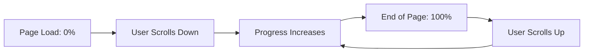

# Data Model: Content Discovery & UX Polish

**Feature**: 003-content-discovery
**Date**: November 4, 2024
**Purpose**: Define data structures, relationships, and calculated fields for blog content enhancements

## Overview

This feature extends existing blog post content with calculated metadata (reading time) and introduces configuration structures for enhanced UI components (footer, progress tracking). No database schema changes are required as this is a static site with markdown-based content.

---

## Entity: Blog Post (Extended)

### Source

- **Location**: `src/content/blog/*.md`
- **Type**: Astro Content Collection
- **Schema File**: `src/content/config.ts` (no modifications required)

### Existing Structure

**Frontmatter Fields** (stored in markdown files):

| Field | Type | Required | Default | Description |
|-------|------|----------|---------|-------------|
| `title` | string | Yes | - | Post title (used in H1, meta tags, listing) |
| `description` | string | Yes | - | Post summary (meta description, listing preview) |
| `pubDate` | Date | Yes | - | Publication date (format: "MMM DD YYYY") |
| `updatedDate` | Date | No | null | Last modified date (optional) |
| `heroImage` | string | No | null | Path to hero image (optional, relative to src/assets) |
| `category` | string | No | null | Post category (Product Management, AI, Motorsport, General) |
| `featured` | boolean | No | false | Whether post is featured on homepage |

**Content Fields** (provided by Astro):

| Field | Type | Source | Description |
|-------|------|--------|-------------|
| `body` | string | Raw markdown | Full post content as markdown string |
| `slug` | string | File name | URL-friendly identifier |
| `id` | string | File name | Unique identifier (file name without .md) |

### New Calculated Fields (Build-Time)

These fields are computed during static site generation and not stored in markdown files:

| Field | Type | Calculation | Description |
|-------|------|-------------|-------------|
| `wordCount` | number | `body.split(/\s+/).length` | Total word count of post body |
| `readingTime` | number | `Math.max(1, Math.ceil(wordCount / 200))` | Estimated reading time in minutes (200 WPM) |
| `readingTimeText` | string | `${readingTime} min read` | Formatted reading time for display |

**Calculation Logic:**
```javascript
function calculateReadingTime(post) {
  const wordCount = post.body.split(/\s+/).length;
  const readingTime = Math.max(1, Math.ceil(wordCount / 200));
  return {
    wordCount,
    readingTime,
    readingTimeText: `${readingTime} min read`
  };
}
```

### Validation Rules

| Rule | Constraint | Enforcement |
|------|------------|-------------|
| Word count | Must be ≥ 0 | Automatic (string split always returns array) |
| Reading time | Minimum 1 min | `Math.max(1, ...)` enforces floor |
| Reading time format | "{number} min read" | Template literal ensures consistent format |

### Usage Example

```astro
---
import { getCollection } from 'astro:content';

// Get all posts with reading time
const posts = (await getCollection('blog')).map(post => {
  const wordCount = post.body.split(/\s+/).length;
  const readingTime = Math.max(1, Math.ceil(wordCount / 200));
  return {
    ...post,
    wordCount,
    readingTime,
    readingTimeText: `${readingTime} min read`
  };
});

// Sort by date, show all posts (no .slice limit)
const sortedPosts = posts.sort((a, b) =>
  b.data.pubDate.valueOf() - a.data.pubDate.valueOf()
);
---

{sortedPosts.map(post => (
  <article>
    <h2>{post.data.title}</h2>
    <p>{post.data.description}</p>
    <span class="reading-time">{post.readingTimeText}</span>
  </article>
))}
```

### State Transitions

None - blog posts are static content with no lifecycle state.

### Relationships

None - blog posts have no relational data (no comments, no categories table, no tags).

---

## Entity: Footer Configuration

### Source

- **Location**: `src/components/Footer.astro`
- **Type**: Component-level constants
- **Storage**: Inline in component

### Structure

**Social Links Array:**

```typescript
type SocialLink = {
  name: string;           // Display name (e.g., "LinkedIn")
  url: string;            // External URL
  icon: string;           // Icon identifier or SVG path
  ariaLabel: string;      // Accessible label (e.g., "Richard Warren on LinkedIn")
  external: true;         // Always true for social links
  rel: "noopener noreferrer"; // Security attributes
  target: "_blank";       // Opens in new tab
};
```

**Internal Links Array:**

```typescript
type InternalLink = {
  name: string;           // Display name (e.g., "Newsletter", "RSS")
  url: string;            // Internal path or feed URL
  description?: string;   // Optional tooltip text
  icon?: string;          // Optional icon
};
```

**Copyright Configuration:**

```typescript
type Copyright = {
  year: number;           // Auto-calculated: new Date().getFullYear()
  owner: string;          // Site owner name (from SITE_TITLE const)
  text?: string;          // Optional custom copyright text
};
```

### Example Implementation

```astro
---
import { SITE_TITLE } from '../consts';

const socialLinks: SocialLink[] = [
  {
    name: 'LinkedIn',
    url: 'https://linkedin.com/in/richard-warren4',
    icon: 'linkedin',
    ariaLabel: 'Richard Warren on LinkedIn',
    external: true,
    rel: 'noopener noreferrer',
    target: '_blank'
  }
];

const internalLinks: InternalLink[] = [
  {
    name: 'Newsletter',
    url: '#newsletter',
    description: 'Subscribe to newsletter',
    icon: 'mail'
  },
  {
    name: 'RSS',
    url: '/rss.xml',
    description: 'Subscribe via RSS',
    icon: 'rss'
  }
];

const copyright: Copyright = {
  year: new Date().getFullYear(),
  owner: SITE_TITLE,
  text: `© ${new Date().getFullYear()} ${SITE_TITLE}. All rights reserved.`
};
---

<footer>
  <div class="social-links">
    {socialLinks.map(link => (
      <a
        href={link.url}
        aria-label={link.ariaLabel}
        target={link.target}
        rel={link.rel}
      >
        {link.name}
      </a>
    ))}
  </div>

  <div class="internal-links">
    {internalLinks.map(link => (
      <a href={link.url} title={link.description}>
        {link.name}
      </a>
    ))}
  </div>

  <div class="copyright">
    {copyright.text}
  </div>
</footer>
```

### Validation Rules

| Rule | Constraint | Enforcement |
|------|------------|-------------|
| External links | Must have `target="_blank"` and `rel="noopener noreferrer"` | TypeScript type enforces structure |
| ARIA labels | All external links must have descriptive `aria-label` | TypeScript type enforces presence |
| Copyright year | Must auto-update (no hardcoded values) | `new Date().getFullYear()` always current |
| URLs | Must be valid URLs or internal paths | Manual validation during implementation |

---

## Entity: Reading Progress State

### Source

- **Location**: `src/components/ReadingProgress.astro`
- **Type**: Client-side DOM state (ephemeral)
- **Storage**: None (calculated on demand)

### Structure

**DOM-Derived State:**

```typescript
type ScrollState = {
  scrollTop: number;      // Current vertical scroll position in pixels
  scrollHeight: number;   // Total document height in pixels
  clientHeight: number;   // Viewport height in pixels
};

type ProgressState = {
  scrollPercent: number;  // Calculated progress (0-100)
};
```

### Calculation

```javascript
function calculateProgress(): number {
  const scrollTop = document.documentElement.scrollTop;
  const scrollHeight = document.documentElement.scrollHeight;
  const clientHeight = document.documentElement.clientHeight;

  const scrollable = scrollHeight - clientHeight;
  const scrollPercent = (scrollTop / scrollable) * 100;

  // Clamp between 0 and 100
  return Math.max(0, Math.min(100, scrollPercent));
}
```

### State Transitions



| Trigger | State Change | UI Update |
|---------|--------------|-----------|
| Page load | `scrollPercent` = 0% | Progress bar width: 0% |
| User scrolls down | `scrollPercent` increases proportionally | Progress bar width increases |
| Reach end of page | `scrollPercent` = 100% | Progress bar width: 100% |
| User scrolls up | `scrollPercent` decreases proportionally | Progress bar width decreases |

### Update Throttling

**Performance Optimization:**
```javascript
let ticking = false;

function updateProgressBar() {
  const progress = calculateProgress();
  progressBar.style.width = progress + '%';
  ticking = false;
}

window.addEventListener('scroll', () => {
  if (!ticking) {
    window.requestAnimationFrame(updateProgressBar);
    ticking = true;
  }
});
```

**Throttling Behavior:**
- Maximum update frequency: 60fps (browser paint cycle)
- `requestAnimationFrame` queues update for next paint
- `ticking` flag prevents multiple queued updates per frame
- CSS `transition` smooths visual updates between frames

### Validation Rules

| Rule | Constraint | Enforcement |
|------|------------|-------------|
| Progress range | Must be 0-100% | `Math.max(0, Math.min(100, scrollPercent))` |
| Update frequency | Max 60fps | `requestAnimationFrame` throttles to paint cycle |
| Zero division | Handle when `scrollHeight === clientHeight` | Check `scrollable > 0` before division |

---

## Entity: Component Props

### ReadingProgress.astro

**Props Interface:**
```typescript
interface Props {
  // No props - component automatically detects scroll
}
```

**Output:**
- Fixed-position `<div>` with class `reading-progress-bar`
- Inline `<script>` for scroll tracking
- Scoped `<style>` for bar styling

**Usage:**
```astro
---
import ReadingProgress from '../components/ReadingProgress.astro';
---
<ReadingProgress />
```

### SkipLink.astro

**Props Interface:**
```typescript
interface Props {
  targetId?: string;      // Default: "main-content"
  text?: string;          // Default: "Skip to content"
}
```

**Output:**
- Accessible skip link `<a>` element
- Visually hidden until focused
- Scoped `<style>` for positioning

**Usage:**
```astro
---
import SkipLink from '../components/SkipLink.astro';
---
<SkipLink targetId="main-content" text="Skip to content" />
<main id="main-content">
  <!-- Page content -->
</main>
```

### Footer.astro (Enhanced)

**Props Interface:**
```typescript
interface Props {
  // No props - configuration defined internally
}
```

**Internal Configuration:**
- Social links array
- Internal links array
- Copyright object

**Output:**
- Enhanced footer HTML with social/newsletter/RSS links
- Auto-updating copyright year
- Semantic HTML structure

---

## Data Flow Diagrams

### Reading Time Calculation Flow

```
[Markdown Files]
  src/content/blog/*.md
        |
        v
[Astro Build Process]
  getCollection('blog')
        |
        v
[Calculate Reading Time]
  body.split(/\s+/).length
  Math.ceil(wordCount / 200)
        |
        v
[Static HTML Output]
  <span>8 min read</span>
```

**Key Points:**
- Happens at build time (zero runtime cost)
- No storage required (calculated on demand)
- Result is static HTML (no JavaScript needed)

### Reading Progress Flow

```
[User Scrolls]
        |
        v
[Scroll Event]
        |
        v
[Throttle Check]
  if (!ticking)
        |
        v
[requestAnimationFrame]
  Queue update
        |
        v
[Calculate Progress]
  scrollTop / scrollableHeight
        |
        v
[Update DOM]
  progressBar.style.width = %
```

**Key Points:**
- Runs client-side (requires JavaScript)
- Throttled to 60fps max (smooth performance)
- Progressive enhancement (content works without it)

---

## Summary

### Data Storage

| Entity | Storage Type | Persistence | Calculation Time |
|--------|-------------|-------------|------------------|
| Blog Post Content | Markdown files | Permanent | - |
| Reading Time | Calculated | None (ephemeral) | Build time |
| Footer Config | Component code | Permanent (source code) | - |
| Reading Progress | DOM state | None (session) | Runtime (on scroll) |

### No API Contracts Required

This is a frontend-only feature with:
- Static markdown content (no API endpoints)
- Build-time calculations (no backend)
- Client-side UI state (no server state)
- Component-level configuration (no external config)

---

**Data Model Complete**: November 4, 2024
**Next Phase**: Implementation tasks (see tasks.md after running `/speckit.tasks`)
